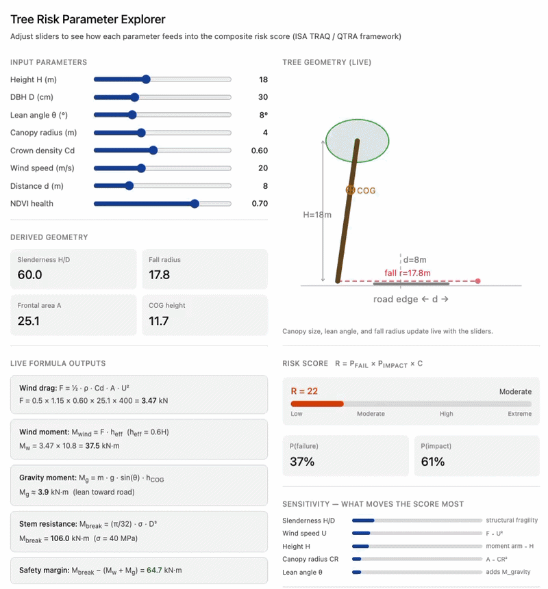
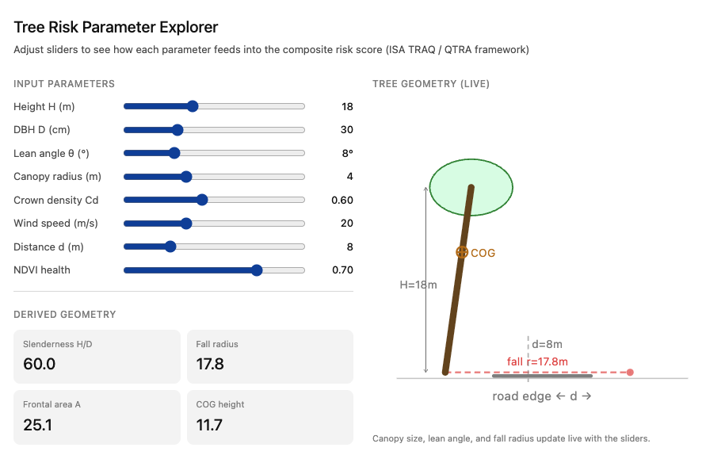
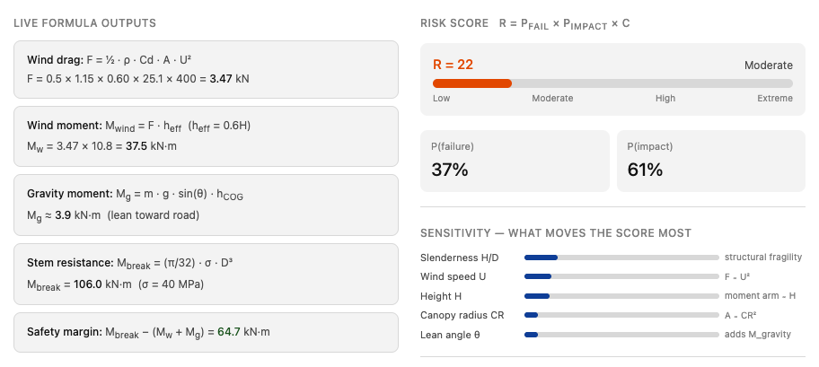

# Roadside Tree Risk Simulation

**[Live demo →](https://oluflourish.github.io/roadside-tree-risk-simulation/tree_risk_explorer.html)**



An interactive, single-file browser tool for exploring how tree morphology and environmental parameters combine into a composite roadside fall-risk score. Built on the ISA TRAQ / QTRA framework with physics-based wind loading and gravity mechanics.

---

## Overview

Open `tree_risk_explorer.html` in any modern browser — no build step, no server, no dependencies. Drag sliders to adjust eight input parameters and watch every derived quantity, the live SVG tree schematic, the risk score bar, and the sensitivity ranking update in real time.

The tool is aimed at arborists, urban foresters, and researchers who want to develop intuition for which field measurements matter most and how the underlying physics connects them.

---

## Features

- **Live SVG schematic** — canopy size, lean angle, fall radius arc, and COG marker all update with the sliders
- **Physics-based moment calculation** — wind drag force, wind overturning moment, gravity lean moment, and stem break resistance computed on every slider event
- **Composite risk score** — `R = P_failure × P_impact × C_road` binned into ISA TRAQ categories (Low / Moderate / High / Extreme)
- **Sensitivity ranking** — shows which parameter is currently driving the score most, recalculated live for the current slider state
- **Extracted assessments** — six named checks (fall reach, slenderness, safety margin, drag force, NDVI flag, ISA TRAQ rating) with pass/fail colouring
- **Dark mode** — respects `prefers-color-scheme` automatically
- **No dependencies** — pure HTML + CSS + vanilla JS, ~530 lines, opens offline

---

## Usage

```
open tree_risk_explorer.html        # macOS
start tree_risk_explorer.html       # Windows
xdg-open tree_risk_explorer.html    # Linux
```

Or serve locally if you prefer:

```
python3 -m http.server 8000
# then visit http://localhost:8000/tree_risk_explorer.html
```

---

## Input Parameters

| Slider | Symbol | Range | Description |
|---|---|---|---|
| Height | H | 5 – 40 m | Total tree height |
| DBH | D | 10 – 80 cm | Diameter at breast height (1.3 m) |
| Lean angle | θ | 0 – 30 ° | Inclination toward road |
| Canopy radius | CR | 1 – 10 m | Mean crown spread radius |
| Crown density | Cd | 0.30 – 1.00 | Aerodynamic drag coefficient of crown |
| Wind speed | U | 5 – 50 m/s | Design gust speed |
| Distance | d | 1 – 30 m | Tree base to road-edge distance |
| NDVI health | — | 0.10 – 0.90 | Normalised Difference Vegetation Index proxy for structural health |

---

## How the Parameters Connect — Mathematical Chains

### Geometry chain

**Height H** and **DBH D** combine into the slenderness ratio `H/D`, which is the single strongest structural predictor — trees above `H/D > 80` are broadly considered fragile. The **lean angle θ** and **canopy radius CR** determine whether the fall radius `H · cos θ` actually reaches the road distance `d` — this is the binary gateway to impact probability.

### Wind loading chain

**Canopy radius CR** → projected frontal area `A = π · CR² / 2` → drag force `F = ½ · ρ · Cd · A · U²` (F grows with U²). That force multiplied by the effective lever arm `h_eff = 0.6H` gives the wind overturning moment M_wind. Note `F ∝ U²` means doubling wind speed **quadruples** the moment — which is why wind speed dominates the sensitivity ranking.

### Gravity chain

**Lean angle θ** adds a permanent gravitational overturning moment `M_g = m · g · sin(θ) · h_COG`, even at zero wind. The mass `m` is estimated from H and D via a simple allometric relation. This is why a leaning tree at moderate wind is far more dangerous than an upright tree in a storm.

### Failure criterion

The stem's resistive moment `M_break = (π/32) · σ · D³` is what the tree can withstand. When `M_wind + M_g` exceeds `M_break`, the safety margin turns negative — shown in red — and failure probability shoots toward 1. **DBH has a cubic effect here**, which is why a small increase in trunk diameter provides disproportionate structural strength.

### Risk score

`R = P_failure × P_impact × C_road`. The sensitivity bars show which parameter is currently moving the score most given your current inputs — useful for prioritising what to measure most precisely in the field.

---

## Model Details

### Constants

| Symbol | Value | Source |
|---|---|---|
| ρ (air density) | 1.15 kg/m³ | Standard atmosphere |
| σ (modulus of rupture) | 40 MPa | Typical hardwood/softwood mean |
| h_eff | 0.6 H | GALES / HWIND convention |
| h_COG | 0.65 H | Allometric approximation |
| m | 150 · H · D² kg | Simplified allometric relation |

### Failure probability

`P_fail` is a weighted combination of three sub-scores:

| Component | Weight | Basis |
|---|---|---|
| Mechanical ratio M_total / M_break | 60 % | Physics |
| Slenderness H/D bin | 25 % | Structural fragility index |
| NDVI health | 15 % | Tree condition |

### Impact probability

- If `fall_radius > d`: `P_impact = 0.40 + 0.40 · (θ/30°) + 0.20 · min(1, CR/d)`
- If `fall_radius ≤ d`: `P_impact = 0.05` (residual probability, tree cannot physically reach road)

### ISA TRAQ risk bins

| R score | Category |
|---|---|
| < 5 | Low |
| 5 – 24 | Moderate |
| 25 – 59 | High |
| ≥ 60 | Extreme |

---

## Screenshots

| Parameters panel | Risk outputs |
|---|---|
|  |  |

---

## References

- Dunster, J. A., Smiley, E. T., Matheny, N., & Lilly, S. (2017). *Tree Risk Assessment Manual, 2nd ed.* ISA. (ISA TRAQ)
- Gardiner, B., Peltola, H., & Kellomäki, S. (2000). Comparison of two models for predicting the critical wind speeds required to damage coniferous trees. *Ecological Modelling*, 129(1), 1–23. (GALES)
- Peltola, H., Kellomäki, S., Väisänen, H., & Ikonen, V.-P. (1999). A mechanistic model for assessing the risk of wind and snow damage to single trees. *Silva Fennica*, 33(2), 77–92. (HWIND)
- Quantified Tree Risk Assessment (QTRA) framework — Ellison, M. J. (2005).
